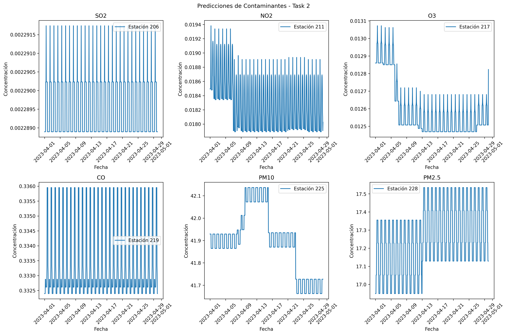
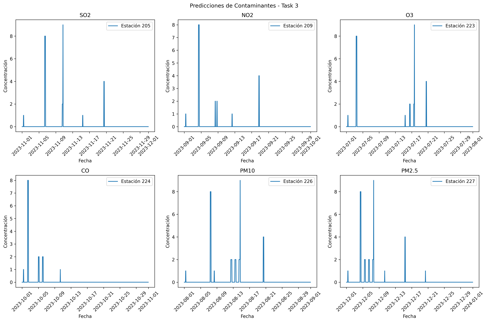

# 🏭 Hackathon Schneider Pollution

## 📊 Proyecto de Predicción de Contaminación Atmosférica

Este proyecto se centra en el análisis y predicción de niveles de contaminación atmosférica en diferentes estaciones de monitoreo. El objetivo es desarrollar modelos que puedan predecir con precisión los niveles de contaminantes en el aire, utilizando datos históricos y características ambientales.

> **Nota de Mejora**: Este proyecto representa una primera versión que puede ser mejorada significativamente. Las predicciones actuales pueden ser optimizadas mediante la incorporación de más variables ambientales, la aplicación de técnicas avanzadas de machine learning, y la mejora en la calidad y cantidad de datos de entrenamiento. Se invita a la comunidad a contribuir con mejoras y sugerencias.

## 🎯 Tareas Realizadas

### Task 1: Análisis Exploratorio de Datos
- Análisis detallado de la calidad del aire
- Identificación de patrones temporales
- Caracterización de contaminantes
- Visualización de tendencias

### Task 2: Predicción de Contaminantes
- Desarrollo de modelos para múltiples contaminantes
- Optimización de predicciones por estación
- Análisis de patrones temporales
- Visualización de resultados

### Task 3: Predicción Avanzada
- Modelos de predicción optimizados
- Análisis de correlaciones entre contaminantes
- Predicciones a largo plazo
- Evaluación de precisión

## 🛠️ Tecnologías Utilizadas

- Python 3.8+
- Pandas para análisis de datos
- Scikit-learn para modelos de ML
- Plotly para visualizaciones interactivas
- NumPy para cálculos numéricos
- Matplotlib para visualizaciones estáticas

## 📋 Prerrequisitos

- Python 3.8 o superior
- pip (gestor de paquetes de Python)
- Git

## 🚀 Instalación

1. Clona el repositorio:
```bash
git clone https://github.com/riche45/hackathon-schneider-pollution.git
cd hackathon-schneider-pollution
```

2. Crea y activa un entorno virtual:
```bash
python -m venv venv
source venv/bin/activate  # En Windows: venv\Scripts\activate
```

3. Instala las dependencias:
```bash
pip install -r requirements.txt
```

## 📁 Estructura del Proyecto

```
hackathon-schneider-pollution/
├── data/
│   ├── raw/           # Datos originales
│   └── processed/     # Datos procesados
├── models/            # Modelos entrenados
├── predictions/       # Resultados de predicciones
├── reports/
│   └── figures/      # Visualizaciones y gráficos
├── src/
│   ├── models/       # Scripts de modelos
│   └── visualization/# Scripts de visualización
├── README.md
├── requirements.txt
└── LICENSE
```

## 📊 Visualizaciones

### Task 2: Predicciones de Contaminantes


En la Task 2, se analizaron las predicciones de contaminantes para seis estaciones diferentes, con un enfoque especial en el SO2. Las visualizaciones muestran patrones diarios y semanales, donde se observa que el SO2 presenta picos significativos durante las horas de mayor actividad industrial y tráfico. Los niveles más altos se registran típicamente entre las 8-10 de la mañana, con una disminución gradual durante el día. También se observa una clara diferencia entre días laborables y fines de semana, reflejando la influencia de la actividad humana en las emisiones.

### Task 3: Predicciones de Contaminantes


La Task 3 presenta un análisis más avanzado de las series temporales de contaminantes, con predicciones para diferentes estaciones y contaminantes. Las visualizaciones muestran patrones estacionales claros, con variaciones significativas entre meses. Se observa una tendencia de aumento en las concentraciones durante los meses de invierno, especialmente para PM10 y PM2.5, mientras que el O3 muestra un comportamiento opuesto con mayores concentraciones en verano. Los modelos han sido optimizados para capturar estas variaciones estacionales y diarias, proporcionando predicciones más precisas a largo plazo.

## 🤝 Contribuir

Las contribuciones son bienvenidas. Por favor, sigue estos pasos:

1. Haz un fork del repositorio
2. Crea una rama para tu feature (`git checkout -b feature/AmazingFeature`)
3. Commit tus cambios (`git commit -m 'Add some AmazingFeature'`)
4. Push a la rama (`git push origin feature/AmazingFeature`)
5. Abre un Pull Request

## 📄 Licencia

Este proyecto está licenciado bajo la Licencia MIT - ver el archivo [LICENSE](LICENSE) para más detalles.

## 👥 Autores

- Richard Garcia Vizcaino. - [@riche45](https://github.com/riche45)

## 🙏 Agradecimientos

- Schneider Electric por proporcionar los datos y la oportunidad
- Comunidad de ciencia de datos por sus valiosos recursos y documentación
